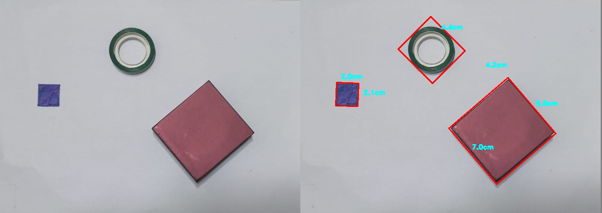
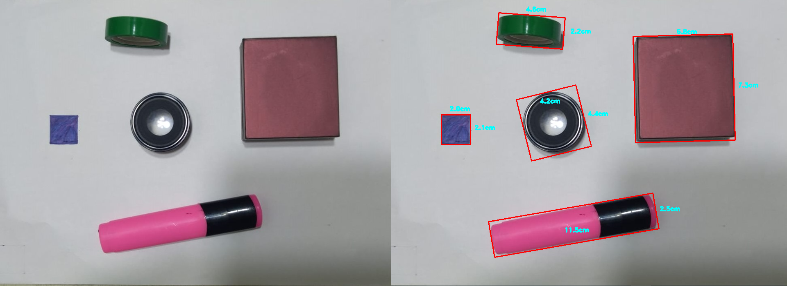

# Object Measurement in Python OpenCV

In this project I created a code to read an image and identify various objects on it. With one object being reference object, it identifies dimension of all other objects in the image with respect to it. As a result an the dimensions of all objects in image is returned.

# Modules Used

* Python 3

* OpenCV

* Numpy

* Imutils

# Image Constraints

* Backround: background must be significantly light/ dark with respeect to objects.

* Distance: Considerble distance b/w object should be maintained.

* Size: Object must be significantly big to be measured.

# Steps Followed

1. Read an image. 

2. Convert image into grayscale.

3. Find contours.

4. Remove small contours.

5. Sort contours from left to right to find the reference object.

6. Reference object (here leftmost box 2 cm * 2cm ).

7. Calculate pixels per cm.

8. Calculate Results. 

9. Draw boundary boxes around each object and calculate its height and width.

# Output

# Limitations

* Only work for clear 2D objects.

* Image should be in perfect top-down view.

* Not very accurate.

# Authors

Jahanvi Jeswani

# Acknowledgments

https://www.pyimagesearch.com/
